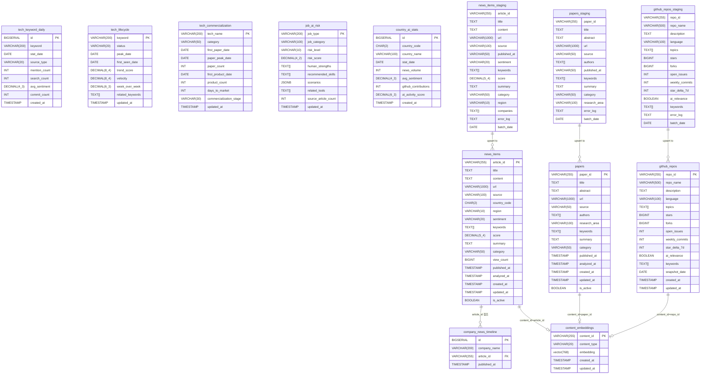

# AiRadar Database ERD

## 테이블 분류

| 그룹 | 테이블 |
|------|--------|
| **Gold (서빙)** | `news_items`, `papers`, `github_repos` |
| **집계/분석** | `tech_keyword_daily`, `tech_lifecycle`, `tech_commercialization`, `job_ai_risk`, `country_ai_stats`, `company_news_timeline` |
| **벡터 검색** | `content_embeddings` (pgvector 768차원) |
| **스테이징** | `news_items_staging`, `papers_staging`, `github_repos_staging` |
| **뷰** | `tech_contents_view` (Materialized View, news + papers 통합) |

> 외래키(FK)는 파이프라인 유연성을 위해 의도적으로 정의하지 않았습니다. 위 관계는 논리적 참조 관계입니다.
