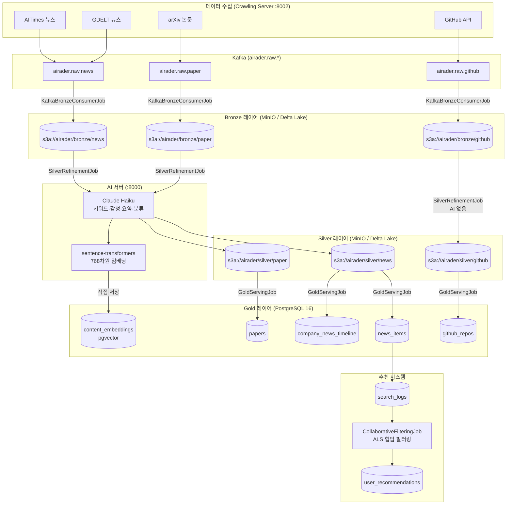

# AIRadar 데이터 파이프라인 가이드

> 팀 내 신규 개발자를 위한 파이프라인 전체 학습 문서입니다.
> Lambda Architecture + Medallion Architecture (Bronze → Silver → Gold) 기반의 실시간 뉴스 인텔리전스 플랫폼입니다.

---

## 목차

1. [전체 파이프라인 흐름](#1-전체-파이프라인-흐름)
2. [레이어별 상세 설명](#2-레이어별-상세-설명)
   - [Bronze 레이어](#21-bronze-레이어)
   - [Silver 레이어](#22-silver-레이어)
   - [Gold 레이어](#23-gold-레이어)
3. [Airflow DAG 구성](#3-airflow-dag-구성)
4. [추천 시스템 (Collaborative Filtering)](#4-추천-시스템-collaborative-filtering)
5. [운영 가이드](#5-운영-가이드)

---

## 1. 전체 파이프라인 흐름



### 단순 텍스트 흐름 요약

```
크롤링 서버 → Kafka → KafkaBronzeConsumerJob → Bronze (Delta Lake)
                                                      ↓
                                           SilverRefinementJob
                                                      ↓
                                            AI 서버 배치 분석
                                           ├─ Claude Haiku → 분석 결과
                                           └─ sentence-transformers → content_embeddings (직접 저장)
                                                      ↓
                                           Silver (Delta Lake)
                                                      ↓
                                            GoldServingJob (JDBC)
                                                      ↓
                                           Gold (PostgreSQL)
                                                      ↓
                                           Spring Boot REST API
                                                      ↓
                                           Next.js 프론트엔드
```

---

## 2. 레이어별 상세 설명

### 2.1 Bronze 레이어

**원칙: 원본 불변 (Immutable)**

Bronze는 수집된 원본 데이터를 그대로 보존하는 레이어입니다. 정제·변환을 일절 하지 않으며, 재처리가 필요할 때 Silver부터 다시 실행하면 됩니다. Bronze 파티션을 직접 수정하거나 삭제하는 것은 절대 금지입니다.

#### 수집 방식

Bronze 적재에는 두 가지 방식이 있습니다.

| 방식 | Job | 현재 상태 | 설명 |
|---|---|---|---|
| HTTP 직접 호출 | `BronzeIngestionJob` | (레거시 / 비활성) | Spark가 크롤링 서버 `/crawl/jobs`를 직접 호출 |
| Kafka Consumer | `KafkaBronzeConsumerJob` | **현재 운영 중** | 크롤링 서버 → Kafka → Spark Streaming |

**KafkaBronzeConsumerJob 동작 방식**

크롤링 서버가 데이터를 수집하면 Kafka 토픽에 발행합니다. `KafkaBronzeConsumerJob`은 `Trigger.AvailableNow()` 모드를 사용하여 현재 쌓인 메시지를 모두 처리한 뒤 종료합니다. 이는 배치처럼 Airflow에서 주기적으로 호출할 수 있게 해줍니다.

Kafka 토픽 규칙:
- `airader.raw.news` — 뉴스 기사 (AITimes, GDELT 공통)
- `airader.raw.paper` — 논문 (arXiv)
- `airader.raw.github` — GitHub 레포지터리

처리 완료 후 `airader.pipeline.bronze.done` 토픽에 완료 이벤트를 발행합니다.

**크롤링 서버 지원 소스 (`:8002`)**

| 도메인 | Provider | 설명 |
|---|---|---|
| `news` | `aitimes` | AITimes.com 뉴스 크롤링 (Selenium 기반) |
| `news` | `gdelt` | GDELT 프로젝트 AI 뉴스 수집 |
| `paper` | `arxiv_api` | arXiv API 논문 수집 (`cat:cs.AI` 기본 쿼리) |
| `github_archive` | `github_api` | GitHub REST API 레포 검색 |
| `github_archive` | `github_trending_archive` | GH Archive 기반 트렌딩 레포 수집 |

arXiv 수집 시 주의: 기본 타임아웃 15초는 200건 요청에 부족합니다. `CRAWLER_TIMEOUT_SEC=60` 이상을 권장합니다.

#### Bronze Delta Lake 경로

```
s3a://airader/bronze/news/batch_date=2026-03-20/
s3a://airader/bronze/paper/batch_date=2026-03-20/
s3a://airader/bronze/github/batch_date=2026-03-20/
```

파티션 키는 `batch_date`입니다. `date=`가 아님에 주의하세요.

#### source type별 Bronze 스키마

**news**

| 컬럼 | 타입 | 설명 |
|---|---|---|
| `article_id` | STRING (PK) | URL SHA1 해시 (재수집 시 멱등성 보장) |
| `title` | STRING | 기사 제목 |
| `content` | STRING | 기사 본문 (크롤러 `body` 필드) |
| `url` | STRING | 원본 URL |
| `source` | STRING | 출처 (aitimes, gdelt 등) |
| `author` | STRING | 작성자 |
| `published_at` | STRING | 발행일시 (ISO8601) |
| `crawled_at` | TIMESTAMP | 수집 시각 |
| `batch_date` | DATE | 파티션 키 |

**paper**

| 컬럼 | 타입 | 설명 |
|---|---|---|
| `paper_id` | STRING (PK) | URL SHA1 해시 |
| `title` | STRING | 논문 제목 |
| `abstract` | STRING | 초록 (크롤러 `body` 필드) |
| `url` | STRING | arXiv URL |
| `source` | STRING | `"paper"` 고정 |
| `authors` | ARRAY[STRING] | 저자 목록 |
| `published_at` | STRING | arXiv 발행일 |
| `crawled_at` | TIMESTAMP | 수집 시각 |
| `batch_date` | DATE | **arXiv 발행일이 아닌 수집 시각 기준** |

> 논문의 `batch_date`는 arXiv 발행일이 아닌 Kafka 수신 시각을 기준으로 설정됩니다. arXiv 논문은 수일~수주 전 발행일을 가질 수 있어, Silver Job의 `--date` 인자와 불일치가 발생하지 않도록 하기 위해서입니다.

**github**

| 컬럼 | 타입 | 설명 |
|---|---|---|
| `repo_id` | STRING (PK) | GitHub full_name (예: `openai/gpt-4`) 또는 URL SHA1 |
| `repo_name` | STRING | 레포지터리 이름 |
| `description` | STRING | 레포 설명 |
| `url` | STRING | GitHub URL |
| `source` | STRING | `"github"` 고정 |
| `language` | STRING | 주 언어 |
| `stars` | LONG | 스타 수 |
| `forks` | LONG | 포크 수 |
| `open_issues` | INT | 이슈 수 (미제공 시 NULL) |
| `topics` | ARRAY[STRING] | 토픽 태그 |
| `weekly_commits` | INT | 주간 커밋 수 (미제공 시 NULL) |
| `star_delta_7d` | INT | 7일간 스타 증감 (미제공 시 NULL) |
| `readme_excerpt` | STRING | README 발췌 |
| `crawled_at` | TIMESTAMP | 수집 시각 |
| `batch_date` | DATE | 파티션 키 |

#### 멱등성 보장

같은 `--date`로 BronzeIngestionJob을 재실행하면 해당 파티션을 `replaceWhere`로 덮어씁니다.

```java
df.write()
    .format("delta")
    .mode(SaveMode.Overwrite)
    .option("replaceWhere", "batch_date = '" + date + "'")
    .partitionBy("batch_date")
    .save(outputPath);
```

---

### 2.2 Silver 레이어

**원칙: AI 분석 결과 병합 + 정제**

Silver는 Bronze 데이터를 읽어 AI 서버에 배치 분석을 요청하고, 결과를 병합하여 정규화된 형태로 저장하는 레이어입니다.

#### AI 서버 배치 분석 흐름 (`SilverRefinementJob`)

```
Bronze 파티션 읽기 (batch_date = {{ ds }})
    ↓
repartition(AI_SERVER_CONCURRENCY) — 파티션별 AI 호출 병렬화
    ↓
파티션별 HttpClient 생성 (재사용)
    ↓
AI_BATCH_SIZE (기본 10건) 씩 묶어서 POST 요청
    ├─ news  → POST /analyze/news/batch
    ├─ paper → POST /analyze/paper/batch
    └─ github → AI 호출 없음 (키워드 기반 로컬 정제)
    ↓
응답 병합 → Silver Delta Lake에 Overwrite (replaceWhere)
```

AI 서버는 분석 결과를 반환하는 것과 동시에 `content_embeddings` 테이블에 768차원 임베딩을 직접 저장합니다. Silver/Gold 레이어에는 임베딩 컬럼이 없습니다.

#### 에러 처리 전략

AI 서버 호출 실패 시 **파이프라인을 중단하지 않습니다**. 실패한 배치의 각 레코드에 `error_log` 컬럼에 에러 메시지를 기록하고 계속 진행합니다.

```
AI 서버 배치 호출 실패
    ↓
각 레코드: error_log = "에러 메시지"
           나머지 분석 필드 = NULL
    ↓
Silver에 저장 (분석 실패 기록으로 보존)
    ↓
GoldServingJob에서 "error_log IS NULL" 필터로 제외
```

이 방식의 장점:
- GMS 키 만료, AI 서버 일시 장애 등으로 일부 배치가 실패해도 파이프라인이 계속 실행됩니다.
- 같은 날짜로 SilverRefinementJob을 재실행(`replaceWhere` Overwrite)하면 실패 건이 자동으로 재처리됩니다.

#### GitHub 정제 로직 (AI 서버 미호출)

GitHub 레포는 AI 서버를 호출하지 않고, `description`과 `topics` 필드에서 AI 관련 키워드(`ai`, `ml`, `llm`, `machine learning`, `deep learning`)를 탐지하여 `ai_relevance` 불리언 값을 설정합니다.

#### Silver 스키마

**news**

| 컬럼 | 타입 | 출처 |
|---|---|---|
| `article_id` | STRING | Bronze |
| `title`, `content`, `url`, `source`, `published_at` | STRING | Bronze 원본 |
| `sentiment` | STRING | AI (`POSITIVE`/`NEGATIVE`/`NEUTRAL`) |
| `keywords` | ARRAY[STRING] | AI |
| `score` | DOUBLE | AI (관련성 점수) |
| `summary` | STRING | AI |
| `category` | STRING | AI |
| `region` | STRING | AI (`DOMESTIC`/`GLOBAL`) |
| `companies` | ARRAY[STRING] | AI (현재 NULL, 향후 구현 예정) |
| `error_log` | STRING | 분석 실패 시 에러 메시지 |
| `batch_date` | DATE | 파티션 키 |

**paper**

| 컬럼 | 타입 | 출처 |
|---|---|---|
| `paper_id` | STRING | Bronze |
| `title`, `abstract`, `url`, `source`, `authors`, `published_at` | 다양 | Bronze 원본 |
| `keywords` | ARRAY[STRING] | AI |
| `summary` | STRING | AI |
| `category` | STRING | AI (`Vision`/`NLP`/`RL`/`Multimodal`/`Robotics`/`ETC`) |
| `research_area` | STRING | AI (`cs.AI`/`cs.LG`/`cs.CV`/`cs.CL`) |
| `error_log` | STRING | 분석 실패 시 에러 메시지 |
| `batch_date` | DATE | 파티션 키 |

**github**

| 컬럼 | 타입 | 출처 |
|---|---|---|
| `repo_id`, `repo_name`, `description`, `language` | STRING | Bronze |
| `topics`, `keywords` | ARRAY[STRING] | Bronze / 로컬 정제 |
| `stars`, `forks` | LONG | Bronze |
| `open_issues`, `weekly_commits`, `star_delta_7d` | INT | Bronze (NULL 가능) |
| `ai_relevance` | BOOLEAN | 로컬 키워드 탐지 |
| `error_log` | STRING | 정제 실패 시 에러 메시지 |
| `batch_date` | DATE | 파티션 키 |

#### 멱등성 보장

Bronze와 동일한 `replaceWhere` + `Overwrite` 패턴으로 같은 날짜 재실행 시 해당 파티션만 교체됩니다. GMS 키 복구 후 동일 날짜로 재트리거하면 실패 건이 자동 재처리됩니다.

---

### 2.3 Gold 레이어

**원칙: 서비스 가능한 형태로 PostgreSQL에 Upsert**

GoldServingJob은 Silver에서 분석 성공한 데이터(`error_log IS NULL`)만 읽어 PostgreSQL에 적재합니다.

#### Staging 패턴 Upsert

Spark는 PostgreSQL `ON CONFLICT DO UPDATE` 구문을 직접 지원하지 않기 때문에, Staging 테이블을 경유하는 2단계 방식을 사용합니다.

```
1단계: Silver → Staging 테이블 (Spark JDBC Overwrite)
       news_items_staging, papers_staging, github_repos_staging

2단계: Staging → 원본 테이블 (단일 트랜잭션)
       INSERT INTO ... SELECT FROM staging ON CONFLICT DO UPDATE SET ...
```

2단계는 단일 트랜잭션(`conn.setAutoCommit(false)`)으로 실행되므로, 중간에 실패하면 롤백됩니다.

#### Gold 테이블별 Conflict Key

| 테이블 | Conflict Key | 업데이트 컬럼 |
|---|---|---|
| `news_items` | `article_id` | sentiment, keywords, score, summary, category, region, analyzed_at |
| `papers` | `paper_id` | keywords, summary, category, research_area, analyzed_at |
| `github_repos` | `repo_id` | stars, forks, open_issues, weekly_commits, star_delta_7d, ai_relevance, keywords, snapshot_date |
| `github_repo_daily` | `(repo_id, snapshot_date)` | stars, forks, open_issues, weekly_commits, star_delta_1d |
| `company_news_timeline` | `(company_name, article_id)` | DO NOTHING |

#### GoldServingJob 실행 순서

```
1. upsertNews()         → news_items_staging → news_items
2. upsertCompanyTimeline() → news_items_staging에서 companies 배열 unnest → company_news_timeline
3. upsertPapers()       → papers_staging → papers
4. upsertGithubRepos()  → github_repos_staging → github_repos
   └─ insertGithubDaily() → github_repo_daily_staging → github_repo_daily
                           (전날 stars와 비교하여 star_delta_1d 계산)
5. publishDoneEvent()   → Kafka 'airader.pipeline.gold.done' 토픽에 완료 이벤트 발행
```

#### github_repo_daily star_delta_1d 계산

```
오늘 Silver의 stars — 전날 github_repo_daily의 stars = star_delta_1d
```

첫 수집일(전날 데이터 없음)에는 `star_delta_1d = NULL`로 처리됩니다.

#### content_embeddings (pgvector)

임베딩은 Gold 파이프라인을 거치지 않습니다. AI 서버가 Silver 분석과 동시에 `content_embeddings` 테이블에 직접 저장합니다. Spring Boot는 유사도 검색 시 이 테이블을 직접 조회합니다.

```sql
-- 768차원 벡터, IVFFlat 인덱스 (cosine 유사도)
SELECT content_id, content_type
FROM content_embeddings
ORDER BY embedding <=> '[...]'::vector
LIMIT 10;
```

---

## 3. Airflow DAG 구성

Airflow는 server1(172.26.3.32)에서 실행되며, 포트 8081로 접근합니다.

### DAG 목록

| DAG ID | 스케줄 | 역할 | 현재 상태 |
|---|---|---|---|
| `bronze_ingestion` | `@hourly` | HTTP 직접 수집 (Phase 1) | **비활성** (is_paused_upon_creation=True) |
| `bronze_kafka_ingestion` | `@hourly` | Kafka Consumer 수집 (Phase 2) | **활성** |
| `silver_refinement` | `0 */3 * * *` (3시간마다) | Bronze → Silver AI 분석 | 활성 |
| `gold_serving` | `0 */3 * * *` (3시간마다) | Silver → Gold Upsert | 활성 |
| `recommendation_batch` | `0 2 * * *` (매일 새벽 2시) | ALS 협업 필터링 추천 생성 | 활성 |

### DAG별 상세

#### bronze_kafka_ingestion

```
TaskGroup: bronze_kafka_tasks
    ├─ consume_news   (KafkaBronzeConsumerJob --source-type news)
    ├─ consume_paper  (KafkaBronzeConsumerJob --source-type paper)
    └─ consume_github (KafkaBronzeConsumerJob --source-type github)
    (3개 태스크 병렬 실행)
```

- `max_active_runs=1`: Spark OOM 방지를 위한 동시 실행 제한
- `Trigger.AvailableNow()`: 현재 Kafka 메시지를 모두 처리한 뒤 종료
- 체크포인트(`KAFKA_CHECKPOINT_PATH`)로 중복 처리 없이 exactly-once 보장

#### silver_refinement

```
wait_for_bronze_ingestion (ExternalTaskSensor)
    ↓
refine_news   (SilverRefinementJob --source-type news)
    ↓
refine_paper  (SilverRefinementJob --source-type paper)
    ↓
refine_github (SilverRefinementJob --source-type github)
    ↓
refresh_tech_contents_view (BashOperator, REFRESH MATERIALIZED VIEW CONCURRENTLY)
```

- `ExternalTaskSensor`로 `bronze_kafka_ingestion` DAG 완료를 대기합니다. `poke_interval=60`초, `timeout=3600`초.
- news → paper → github 순차 실행: Spark driver 동시 실행 시 OOM 방지
- 마지막에 `tech_contents_view` Materialized View를 `CONCURRENTLY` 갱신합니다 (조회 블로킹 없음)
- Spark 설정: executor 메모리 1g, 인스턴스 2개 (15g 서버 OOM 방지)

#### gold_serving

```
run_gold_serving (GoldServingJob --date {{ ds }})
```

- `silver_refinement`와 동일 주기(`0 */3 * * *`)로 실행됩니다.
- 현재 Silver 완료 감지가 없으므로, 실행 순서는 스케줄 시각에 의존합니다.

> **주의**: `gold_serving` DAG는 `silver_refinement`와 동일 시각에 트리거되지만, ExternalTaskSensor가 없습니다. Silver 처리 시간이 길어지면 Gold가 아직 정제되지 않은 Silver를 읽을 수 있습니다. 이 경우 `error_log IS NULL` 필터로 인해 0건 적재가 발생할 수 있습니다.

#### recommendation_batch

```
check_min_event_count (PythonOperator)
    ↓ (이벤트 10건 미만이면 AirflowSkipException → SKIP)
run_recommendation_batch (CollaborativeFilteringJob --date {{ ds }})
```

- 매일 새벽 2시 실행 (Gold 완료 후 여유 확보)
- ALS 학습은 메모리 집약적 → executor 1개, 메모리 2g 설정
- Airflow 조건 미충족 시 `AirflowSkipException` 사용 (ValueError는 FAILED 처리됨)

### Airflow 운영 주의사항

- **`--force-recreate` 사용 금지**: Docker Compose 1.29.2 버그로 KeyError 발생. `stop → rm -f → up` 순서 사용
- **환경변수 변경 시 컨테이너 재생성 필수**: `stop → rm → up`으로 재생성해야 env 파일이 반영됨
- **`airflow standalone` 모드 사용 금지**: 부하 시 webserver 강제 종료됨
- **Airflow 컨테이너 메모리**: Spark driver(~1.4g) + Airflow(~800MB) 합산으로 최소 6g 필요. Error code -9는 OOM Kill 신호
- **DAG run 삭제**: CLI 미지원 → `airflow db shell` 후 `DELETE FROM dag_run`으로 직접 처리
- **`@hourly` DAG manual trigger**: DagRunAlreadyExists 에러 발생 시 DB에서 직접 삭제 필요

---

## 4. 추천 시스템 (Collaborative Filtering)

### 전체 흐름

```
사용자 행동 이벤트 발생 (뷰, 검색, 북마크 — 좋아요는 배치에만 정의)
    ↓
search_logs 테이블에 기록 (월별 파티셔닝)
    ↓
매일 새벽 2시: recommendation_batch DAG 실행
    ↓
CollaborativeFilteringJob
    ├─ 이벤트 수 확인 (5명 미만 또는 기사 10개 미만 → SKIP)
    ├─ 최근 30일치 로그 읽기
    ├─ 이벤트 가중치 부여
    ├─ ALS 모델 학습 (maxIter=10, rank=10, regParam=0.1, implicitPrefs=true)
    ├─ 모든 사용자 Top-20 추천 생성
    └─ user_recommendations 테이블에 Upsert
```

### 이벤트 가중치

| 이벤트 타입 | 가중치 | 설명 |
|---|---|---|
| `ARTICLE_VIEWED` | 1.0 | 기사 조회 |
| `ARTICLE_SEARCHED` | 2.0 | 검색 (article_id가 있는 경우만 반영) |
| `ARTICLE_LIKED` | 3.0 | 좋아요 (이벤트 수집 미구현) |
| `ARTICLE_BOOKMARKED` | 5.0 | 북마크 |

같은 (사용자, 기사) 쌍의 이벤트는 가중치를 합산합니다 (implicit feedback).

### 최소 데이터 조건

ALS 학습이 의미 있으려면:
- Airflow 단계: 최근 30일 로그인 이벤트 **10건 이상** (미충족 시 `AirflowSkipException`)
- Spark 단계: 로그인 사용자 **5명 이상**, 기사 **10개 이상** (미충족 시 SKIP 반환)

### ALS 하이퍼파라미터

| 파라미터 | 값 | 설명 |
|---|---|---|
| `maxIter` | 10 | 반복 횟수 |
| `rank` | 10 | 잠재 요인 차원 수 |
| `regParam` | 0.1 | 정규화 계수 (과적합 방지) |
| `implicitPrefs` | true | implicit feedback (클릭·조회 기반) |
| `coldStartStrategy` | drop | 학습 데이터에 없는 사용자/아이템 제외 |

### user_recommendations 저장 패턴

```sql
-- 1. 만료된 추천 삭제
DELETE FROM user_recommendations WHERE expires_at < NOW();

-- 2. Staging에 새 추천 저장 (Spark JDBC Overwrite)
-- user_recommendations_staging: user_id, article_id, score, reason, generated_at, expires_at

-- 3. 단일 트랜잭션으로 원자적 교체
BEGIN;
DELETE FROM user_recommendations
WHERE user_id IN (SELECT DISTINCT user_id FROM user_recommendations_staging);
INSERT INTO user_recommendations (...) SELECT ... FROM user_recommendations_staging;
TRUNCATE TABLE user_recommendations_staging;
COMMIT;
```

추천 유효 기간: 생성 시각 + 1일 (`expires_at = current_timestamp + INTERVAL '1 day'`)

Redis에는 `user:{userId}:profile` Hash(TTL 30일)와 `search:trending` Sorted Set(매일 자정 50% 감쇠)이 보조로 운용됩니다.

---

## 5. 운영 가이드

### 5.1 파이프라인 디버깅 체크리스트

데이터가 0건이거나 누락되었을 때 순서대로 확인합니다.

**1단계: Bronze 파티션 존재 여부**

```bash
# MinIO CLI로 확인 (서버에서 실행)
aws s3 ls s3://airader/bronze/news/ --endpoint-url http://localhost:9000
aws s3 ls "s3://airader/bronze/news/batch_date=2026-03-20/"

# 또는 MinIO 콘솔 (http://server1:9001)에서 직접 확인
```

파티션이 없다면 크롤링 서버 또는 KafkaBronzeConsumerJob을 점검합니다.

**2단계: Silver 에러 로그 확인**

```bash
# Airflow UI에서 silver_refinement DAG 로그 확인
# 또는 Spark History Server에서 SilverRefinementJob 로그 확인

# "[Silver] 배치 분석 실패" 메시지를 검색
# → AI_SERVER_URL 환경변수 확인
# → AI 서버 상태 확인: curl http://172.26.5.50:18000/health
```

GMS 키 만료 증상: `Connect to AI_SERVER_URL failed: Connection timed out` (HTTP 401이 아님에 주의)

**3단계: Silver error_log 필터 확인**

```sql
-- Gold는 error_log IS NULL 조건으로 필터링
-- Silver에 데이터가 있지만 Gold가 0건이면 전부 실패 건인지 확인
SELECT COUNT(*), error_log IS NULL as success
FROM silver_news  -- Delta Lake 직접 쿼리 또는 SparkSQL
WHERE batch_date = '2026-03-20'
GROUP BY success;
```

**4단계: 날짜 불일치 확인**

```bash
# Silver Job의 --date와 Bronze batch_date 파티션 날짜 일치 여부 확인
# Airflow {{ ds }}는 실행 날짜 (execution_date)이며, 실제 수집 날짜와 다를 수 있음
```

---

### 5.2 Silver 재처리 방법

Bronze는 항상 보존되므로 언제든 Silver부터 재처리할 수 있습니다.

**방법 1: Airflow에서 수동 재트리거**

```
Airflow UI → silver_refinement DAG → Trigger DAG w/ config
{ "conf": {} }  -- 동일 날짜로 재실행
```

`replaceWhere` Overwrite로 멱등 처리되므로 중복 걱정 없이 재실행 가능합니다.

**방법 2: Spark Job 직접 실행**

```bash
cd /c/project/S14P21B104/AIRadar/backend

# news Silver 재처리
./gradlew runSparkJob -Pjob=SilverRefinementJob -Pdate=2026-03-20 -PsourceType=news

# paper Silver 재처리
./gradlew runSparkJob -Pjob=SilverRefinementJob -Pdate=2026-03-20 -PsourceType=paper

# Gold 재적재 (Silver 재처리 완료 후)
./gradlew runSparkJob -Pjob=GoldServingJob -Pdate=2026-03-20
```

**Gold Upsert는 멱등성이 보장**(`ON CONFLICT DO UPDATE`)되므로 별도 처리 없이 재실행 가능합니다.

---

### 5.3 주요 환경변수 목록

| 환경변수 | 설명 | 기본값 |
|---|---|---|
| `CRAWL_SERVER_URL` | 크롤링 서버 URL | `http://localhost:8002` |
| `KAFKA_BOOTSTRAP_SERVERS` | Kafka 브로커 주소 | `localhost:9092` |
| `KAFKA_TOPIC_PREFIX` | Kafka 토픽 prefix | `airader.raw` |
| `KAFKA_CHECKPOINT_PATH` | Spark Streaming 체크포인트 경로 | `/tmp/kafka-checkpoint` |
| `BRONZE_BASE_PATH` | Bronze Delta Lake 루트 | `s3a://airader/bronze` |
| `SILVER_BASE_PATH` | Silver Delta Lake 루트 | `s3a://airader/silver` |
| `MINIO_ENDPOINT` | MinIO API 엔드포인트 | `http://minio:9000` |
| `AWS_ACCESS_KEY_ID` | MinIO 접근 키 | (필수) |
| `AWS_SECRET_ACCESS_KEY` | MinIO 비밀 키 | (필수) |
| `AI_SERVER_URL` | AI 분석 서버 URL | `http://localhost:8000` |
| `AI_BATCH_SIZE` | 배치당 레코드 수 | `10` |
| `AI_SERVER_CONCURRENCY` | Spark 파티션 수 = AI 동시 요청 수 | `10` |
| `POSTGRES_JDBC_URL` | PostgreSQL JDBC URL | (필수) |
| `POSTGRES_USER` | PostgreSQL 사용자명 | (필수) |
| `POSTGRES_PASSWORD` | PostgreSQL 비밀번호 | (필수) |
| `SPARK_MASTER` | Spark Master URL | `local[*]` |
| `CRAWLER_TIMEOUT_SEC` | 크롤링 서버 요청 타임아웃 | `15` (권장: 60 이상) |
| `GMS_KEY` | GMS 프록시 API 키 (AI 서버 필수) | (필수) |

> `.env` 파일은 절대 커밋하지 않습니다. `.env.example`, `.env.server1.example`, `.env.server2.example`만 커밋합니다.

---

### 5.4 흔한 장애 패턴 및 해결책

#### Silver 0건 (데이터 없음)

**증상**: Gold 테이블에 데이터가 없거나, Silver Job 로그에 처리 건수 0.

**원인 및 해결**:

1. Bronze 파티션 날짜 불일치: `batch_date`와 Silver `--date` 불일치. 브론즈 파티션 날짜를 확인하고 동일한 날짜로 Silver Job 재실행.
2. Bronze 파티션 자체가 없음: 크롤링 서버 또는 Kafka Consumer 장애. Bronze부터 재수집 필요.

#### AI 서버 타임아웃 (GMS 키 만료)

**증상**: `[Silver] 배치 분석 실패: Connect to AI_SERVER_URL failed: Connection timed out`

**해결**:
```bash
# 1. GMS 키 갱신 후 AI 서버 재시작
docker compose -f docker-compose.server2.yml --env-file .env.server2 restart ai-server

# 2. 동일 날짜로 Silver Job 재트리거 (실패 건 자동 재처리)
# replaceWhere Overwrite로 실패 건이 성공 건으로 교체됨
```

#### Airflow OOM Kill (Error code -9)

**증상**: Airflow 컨테이너의 Spark Job 태스크가 갑자기 종료. `Error code -9`.

**원인**: 컨테이너 메모리 한도 초과. Airflow + Spark driver가 같은 컨테이너에서 실행됨.

**해결**:
```bash
# 컨테이너 메모리 확인
docker inspect server1-airflow | grep Memory

# docker-compose.server1.yml의 mem_limit을 6g 이상으로 설정
# Spark driver.memory=1g 기준 최소 6g 필요
```

executor.memory를 줄여도 해결되지 않습니다. 컨테이너 `mem_limit`을 늘려야 합니다.

#### GH Archive 수집 0건

**증상**: GitHub 크롤링은 성공했지만 데이터가 없음.

**원인**: GH Archive는 약 1시간 지연으로 데이터가 제공됩니다. `github_window_minutes=30`이면 데이터가 없을 수 있습니다.

**해결**: `.env.server1`에서 `github_window_minutes`를 180 이상으로 설정.

#### arXiv ReadTimeout

**증상**: Paper 크롤링 중 `ReadTimeout` 에러. `max_results=200` 요청 시 발생.

**해결**: `.env.server1`에서 `CRAWLER_TIMEOUT_SEC=60` (또는 그 이상) 설정.

#### Airflow `DagRunAlreadyExists` 에러

**증상**: `@hourly` DAG를 manual trigger 시 에러.

**원인**: 해당 시간대 scheduled run이 이미 존재함.

**해결**:
```bash
# Airflow 컨테이너 접속
docker exec -it server1-airflow airflow db shell

# airflow 스키마로 전환 (PostgreSQL)
SET search_path TO airflow;

# 충돌하는 dag_run 삭제
DELETE FROM dag_run WHERE dag_id='bronze_kafka_ingestion' AND run_id='scheduled__2026-03-20T00:00:00+00:00';
DELETE FROM task_instance WHERE dag_id='bronze_kafka_ingestion' AND run_id='scheduled__2026-03-20T00:00:00+00:00';
```

#### AI 서버 SSH 터널 (로컬 개발 시)

로컬 AI 서버를 server1에서 접근하려면 SSH 역방향 터널 설정이 필요합니다.

```bash
# server2에서 실행 (0.0.0.0 바인딩 필수)
ssh -fNR 0.0.0.0:8000:127.0.0.1:8000 \
    -o ServerAliveInterval=30 \
    -o ServerAliveCountMax=10 \
    -i key.pem ubuntu@server2

# server2 ufw 허용 (server1 IP 허용)
sudo ufw allow from 172.26.3.32 to any port 8000

# 터널 확인
ss -tlnp | grep 8000
```

---

### 5.5 더미 데이터 주입 (파이프라인 검증용)

개발 환경에서 파이프라인을 검증할 때 더미 데이터를 주입할 수 있습니다.

```bash
# 크롤링 서버 /crawl/dummy 엔드포인트 (news, paper, github 각 ≥ 1건 필요)
curl -X POST "http://localhost:18002/crawl/dummy?date=2026-03-20&news_count=5&paper_count=5&github_count=1&publish_kafka=true"

# 벌크 수집 스크립트 (백그라운드 실행)
nohup python3 AIRadar/crawling/scripts/bulk_ingest.py \
    --crawl-url http://localhost:18002 > /tmp/bulk_ingest.log 2>&1 &
tail -f /tmp/bulk_ingest.log
```

---

## 참고 문서

| 문서 | 위치 |
|---|---|
| Spark-JPA 충돌 규칙 | `.claude/rules/spark-jpa.md` |
| Medallion 레이어 규칙 | `.claude/rules/medallion-rules.md` |
| AI 서버 API 계약 | `.claude/rules/api-contracts.md` |
| Airflow DAG 작성 규칙 | `.claude/rules/airflow-dag.md` |
| MinIO 스토리지 규칙 | `.claude/rules/minio-storage.md` |
| 로컬 환경 실행 가이드 | `.claude/agent_docs/local-setup.md` |
| 전체 아키텍처 | `.claude/agent_docs/architecture.md` |
| DB ERD | `AIRadar/backend/src/main/resources/db/ERD.md` |
