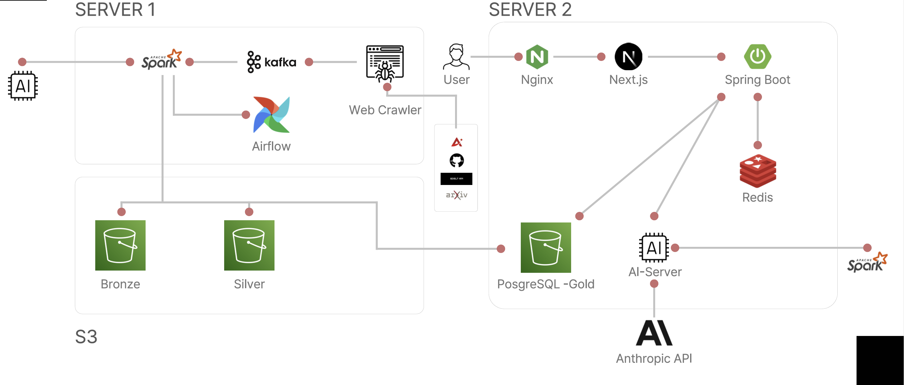
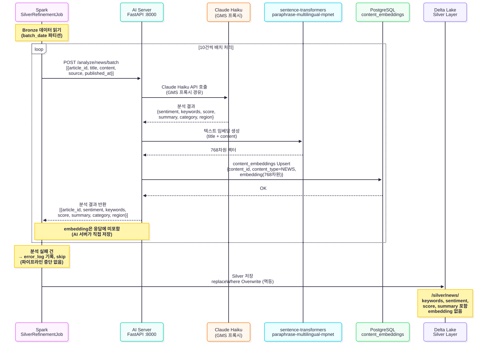

# AiRadar

> 실시간 AI 기술 인텔리전스 플랫폼 — AI 뉴스·논문·GitHub을 자동 수집·분석·개인화하여 한곳에서 제공합니다.

[](https://openjdk.org/)
[](https://spring.io/projects/spring-boot)
[](https://spark.apache.org/)
[](https://nextjs.org/)
[](https://www.python.org/)
[](https://kafka.apache.org/)
[](https://www.postgresql.org/)
[](https://redis.io/)
[](https://airflow.apache.org/)

---

## 목차

- [프로젝트 소개](#프로젝트-소개)
- [핵심 기능](#핵심-기능)
- [시스템 아키텍처](#시스템-아키텍처)
- [데이터 파이프라인](#데이터-파이프라인)
- [AI 분석 흐름](#ai-분석-흐름)
- [추천 시스템](#추천-시스템)
- [기술 스택](#기술-스택)
- [디렉토리 구조](#디렉토리-구조)
- [Quick Start](#quick-start)
- [환경변수](#환경변수)
- [API 개요](#api-개요)
- [문서](#문서)
- [팀원](#팀원)

---

## 프로젝트 소개

AI 기술은 매일 수백 개의 뉴스·논문·오픈소스 프로젝트가 쏟아지지만, 개발자와 연구자는 이를 직접 모아 파악해야 하는 불편함이 있습니다.

**AiRadar**는 이 문제를 해결합니다.

- **자동 수집**: AITimes, GDELT, arXiv, GitHub Archive에서 30분마다 최신 AI 정보를 수집합니다.
- **AI 분석**: Claude Haiku LLM으로 키워드 추출·감정 분석·요약·카테고리 분류를 자동으로 수행합니다.
- **개인화**: 사용자의 조회·검색·좋아요 행동을 학습하여 ALS 협업 필터링 기반 개인화 피드를 제공합니다.
- **트렌드 분석**: 일별 키워드 통계, 기술 생애주기, 직업별 AI 위험도를 대시보드로 시각화합니다.

---

## 핵심 기능

| 기능 | 설명 |
| --- | --- |
| **자동 수집** | AITimes·GDELT(뉴스), arXiv(논문), GitHub Archive(레포) 30분 주기 크롤링 → Kafka 발행 |
| **AI 분석** | Claude Haiku: 키워드·감정(POSITIVE/NEGATIVE/NEUTRAL)·요약·카테고리·지역 분류 |
| **벡터 검색** | `paraphrase-multilingual-mpnet-base-v2` 768차원 임베딩 + pgvector 코사인 유사도 검색 |
| **개인화 추천** | 행동 이벤트(조회·검색·좋아요·북마크) → Redis 프로파일 → Spark ALS 배치 추천 |
| **트렌드 대시보드** | 일별 키워드 언급량, 기술 생애주기(성장/성숙/쇠퇴), 직업별 AI 대체 위험도 |
| **인증·계정** | JWT Access(15분)/Refresh(7일) Rotation, 관심 키워드 수동 등록·추론 |

---

## 시스템 아키텍처



**Lambda Architecture + Medallion Architecture** 기반으로 설계되었습니다.

- **수집 계층**: Crawling Server(FastAPI)가 외부 소스를 크롤링하여 Kafka에 발행
- **파이프라인**: Kafka → Bronze(원본) → Silver(AI 분석) → Gold(PostgreSQL 서빙)
- **서빙 계층**: Spring Boot REST API → Next.js 프론트엔드

---

## 데이터 파이프라인



| 레이어 | 저장소 | 역할 | 불변성 |
| --- | --- | --- | --- |
| **Bronze** | Delta Lake (MinIO) | Kafka 원본 데이터 그대로 적재 | Immutable (절대 수정 불가) |
| **Silver** | Delta Lake (MinIO) | AI 분석 결과 결합, 중복 제거, null 처리 | 재처리 시 replaceWhere Overwrite |
| **Gold** | PostgreSQL 16 | 서비스 직접 사용, Upsert 멱등 보장 | article_id 기준 충돌 처리 |

---

## AI 분석 흐름



1. Spark `SilverRefinementJob`이 Bronze 데이터를 10건씩 묶어 AI 서버에 POST 요청
2. AI 서버(FastAPI)가 Claude Haiku로 키워드·감정·요약·카테고리를 분석하고, sentence-transformers로 768차원 임베딩을 생성
3. 임베딩은 `content_embeddings`(pgvector) 테이블에 직접 저장 (Spark 파이프라인 미경유)
4. 분석 결과만 Spark에 반환 → Silver Delta Lake 저장

---

## 추천 시스템



| 단계 | 설명 |
| --- | --- |
| **이벤트 수집** | 기사 조회(30초↑)·검색·좋아요·북마크 → `@Async` fire-and-forget, 즉시 202 반환 |
| **실시간 프로파일** | Redis `user:{userId}:profile` Hash에 키워드 가중치 실시간 반영 (TTL 30일) |
| **배치 추천** | 매일 새벽 2시 Spark ALS로 `search_logs`(최근 30일) 학습 → `user_recommendations` 저장 |
| **서빙 우선순위** | ① Redis 캐시(30분) → ② ALS 결과 → ③ 관심 키워드 매칭 → ④ 트렌딩 Fallback |

---

## 기술 스택

| 계층 | 기술 | 버전 | 용도 |
| --- | --- | --- | --- |
| **Frontend** | Next.js + React + TypeScript | 16 + 19 | 웹 UI |
| **Backend API** | Spring Boot + Java | 3.3.5 + 17 | REST API 서버 |
| **데이터 처리** | Apache Spark | 3.5.0 (Scala 2.12) | 배치 파이프라인, ALS |
| **데이터 스토리지** | Delta Lake + MinIO | 3.1.0 | Bronze/Silver 레이어 |
| **메시지 브로커** | Apache Kafka | Confluent 7.4.0 | 실시간 데이터 수집 |
| **관계형 DB** | PostgreSQL + pgvector | 16 | Gold 레이어, 벡터 검색 |
| **캐시** | Redis | 7 | 유저 프로파일, 트렌딩, JWT |
| **워크플로우** | Apache Airflow | 2.8.3 | 파이프라인 오케스트레이션 |
| **AI LLM** | Claude Haiku (GMS 프록시) | 4.5 | 콘텐츠 분석 |
| **임베딩 모델** | paraphrase-multilingual-mpnet-base-v2 | HuggingFace | 768차원 벡터 임베딩 |
| **AI 서버** | Python FastAPI | 3.10+ | AI 분석 API |
| **크롤링 서버** | Python FastAPI | 3.10+ | 외부 소스 크롤링 |
| **컨테이너** | Docker + Docker Compose | — | 인프라 구성 |

---

## 디렉토리 구조

```
S14P21B104/
├── AIRadar/
│   ├── backend/                # Spring Boot 3.3.5 + Spark 3.5.0
│   │   └── src/main/java/com/mcp/airadar/
│   │       ├── auth/           # JWT 인증·소셜 로그인
│   │       ├── user/           # 유저 프로파일·관심사·북마크/좋아요
│   │       ├── news/           # 뉴스 조회 API
│   │       ├── paper/          # 논문 조회 API
│   │       ├── github/         # GitHub 레포 API
│   │       ├── dashboard/      # 키워드 트렌드·생애주기·직업 분석
│   │       ├── search/         # 벡터 유사도 검색
│   │       ├── recommendation/ # 개인화 추천 서빙
│   │       ├── kafka/          # Kafka Producer/Consumer
│   │       ├── mail/           # 뉴스레터 구독
│   │       └── spark/          # Spark Job 클래스
│   │           ├── BronzeIngestionJob.java
│   │           ├── KafkaBronzeConsumerJob.java
│   │           ├── SilverRefinementJob.java
│   │           ├── GoldServingJob.java
│   │           └── CollaborativeFilteringJob.java
│   ├── ai-server/              # Python FastAPI — Claude Haiku + sentence-transformers
│   ├── crawling/               # Python FastAPI — 뉴스·논문·GitHub 크롤링 (포트 8002)
│   ├── airflow/
│   │   └── dags/               # Airflow DAG 파일
│   │       ├── silver_refinement_dag.py
│   │       └── gold_serving_dag.py
│   ├── frontend/               # Next.js 16 + React 19
│   └── infra/                  # Docker Compose (10개 서비스)
│       ├── docker-compose.yml
│       └── .env.example
└── docs/
    ├── SRS.md                  # 소프트웨어 요구사항 명세서
    └── diagrams/               # 아키텍처·파이프라인 다이어그램
```

---

## Quick Start

### 사전 요구사항

- [Docker](https://www.docker.com/) & Docker Compose
- Java 17+
- Node.js 18+

### 1. 환경변수 설정

```bash
cp AIRadar/infra/.env.example AIRadar/infra/.env
# .env 파일에서 GMS_KEY 등 필수 값 입력
```

### 2. 인프라 기동

```bash
cd AIRadar/infra/
docker compose up -d
```

> Kafka, PostgreSQL, Redis, MinIO, Airflow, Spark, AI Server, Crawling Server가 함께 기동됩니다.

### 3. Spring Boot 실행

```bash
cd AIRadar/backend/
./gradlew bootRun
# → http://localhost:8888
```

### 4. Next.js 실행

```bash
cd AIRadar/frontend/
npm install && npm run dev
# → http://localhost:3000
```

### 5. 파이프라인 검증 (더미 데이터 주입)

```bash
curl -X POST "http://localhost:8002/crawl/dummy?date=$(date +%Y-%m-%d)&news_count=5&paper_count=5&github_count=1&publish_kafka=true"
```

> Airflow UI(`http://localhost:8081`)에서 DAG 실행 상태를 확인할 수 있습니다.

---

## 환경변수

`AIRadar/infra/.env.example`을 복사하여 `.env`로 사용합니다. **`.env` 파일은 절대 커밋하지 않습니다.**

| 변수 | 필수 | 설명 |
| --- | --- | --- |
| `GMS_KEY` | **필수** | SSAFY GMS 프록시 키 (Claude Haiku 호출용) |
| `MINIO_ROOT_USER` | 필수 | MinIO 접근 키 (기본: `minioadmin`) |
| `MINIO_ROOT_PASSWORD` | 필수 | MinIO 비밀 키 (기본: `minioadmin123`) |
| `POSTGRES_DB` | 필수 | PostgreSQL DB명 (기본: `airadar`) |
| `POSTGRES_USER` | 필수 | PostgreSQL 유저 (기본: `airadar`) |
| `POSTGRES_PASSWORD` | 필수 | PostgreSQL 비밀번호 |
| `AIRFLOW_ADMIN_USERNAME` | 필수 | Airflow 관리자 계정 |
| `AIRFLOW_ADMIN_PASSWORD` | 필수 | Airflow 관리자 비밀번호 |
| `AI_BATCH_SIZE` | 선택 | AI 분석 배치 크기 (기본: `10`) |

---

## API 개요

기본 URL: `http://localhost:8888`
전체 스펙: [`docs/SRS.md`](docs/SRS.md)

| 도메인 | 주요 엔드포인트 | 인증 |
| --- | --- | --- |
| **인증** | `POST /api/v1/auth/register`, `/login`, `/refresh`, `/logout` | — |
| **뉴스** | `GET /api/v1/news`, `GET /api/v1/news/{articleId}` | — |
| **논문** | `GET /api/v1/papers`, `GET /api/v1/papers/{paperId}` | — |
| **GitHub** | `GET /api/v1/github/trending` | — |
| **검색** | `GET /api/search?q={query}` | — |
| **대시보드** | `GET /api/v1/dashboard/keywords`, `/lifecycle`, `/jobs` | — |
| **추천** | `GET /api/v1/recommendations/news`, `/trending` | 일부 필요 |
| **이벤트** | `POST /api/v1/events/article-view`, `/search`, `/article-like`, `/article-bookmark` | 필요 |
| **사용자** | `GET/PATCH /api/v1/users/me`, `/interests`, `/history`, `/bookmarks`, `/likes` | 필요 |
| **뉴스레터** | `POST /api/v1/mail`, `DELETE /api/v1/mail` | — |

> 응답 형식: `{"success": true, "data": {...}}`

---

## 문서

| 문서 | 링크 | 설명 |
| --- | --- | --- |
| 소프트웨어 요구사항 명세서 (SRS) | [`docs/SRS.md`](docs/SRS.md) | 기능·비기능 요구사항 전체 |
| 시스템 아키텍처 다이어그램 | [`docs/diagrams/01_system_architecture.md`](docs/diagrams/01_system_architecture.md) | 전체 서비스 구성 |
| 데이터 파이프라인 다이어그램 | [`docs/diagrams/02_data_pipeline.md`](docs/diagrams/02_data_pipeline.md) | Bronze → Silver → Gold 흐름 |
| AI 분석 흐름 다이어그램 | [`docs/diagrams/03_ai_analysis_flow.md`](docs/diagrams/03_ai_analysis_flow.md) | Spark → AI Server → DB |
| 추천 시스템 다이어그램 | [`docs/diagrams/04_recommendation_flow.md`](docs/diagrams/04_recommendation_flow.md) | 이벤트 → ALS → 서빙 |
| ERD | [`docs/diagrams/05_erd.puml`](docs/diagrams/05_erd.puml) | 전체 DB 테이블 관계 |
| 로컬 실행 가이드 | [`.claude/agent_docs/local-setup.md`](.claude/agent_docs/local-setup.md) | 포트 매핑, 명령어, 트러블슈팅 |
| 추천 API 가이드 (프론트엔드용) | [`AIRadar/frontend/RECOMMENDATION_API.md`](AIRadar/frontend/RECOMMENDATION_API.md) | 이벤트 발송 및 추천 피드 연동 |

---

## 팀원

| 이름 | 역할 | GitHub |
| --- | --- | --- |
| 이재영 | 팀장 / Backend / Data Pipeline | [@ljy0221](https://github.com/ljy0221/ljy0221) |
| 임지민 | Backend / Crawling | [@jimmy0524](https://github.com/jimmy0524) |
| 이상협 | Data Analytics / AI | [@Tyler-1102](https://github.com/Tyler-1102) |
| 양수영 | Infra / DevOps | [@Swimming-Yang](https://github.com/Swimming-Yang) |
| 김동현 | Frontend | [@hosup2](https://github.com/hosup2) |
| 하서영 | Frontend | [@Seoyeong-max](https://github.com/seoyeong-max) |

---

<p align="center">
  <sub>SSAFY 14기 2학기 프로젝트 — AiRadar Team MCP</sub>
</p>
