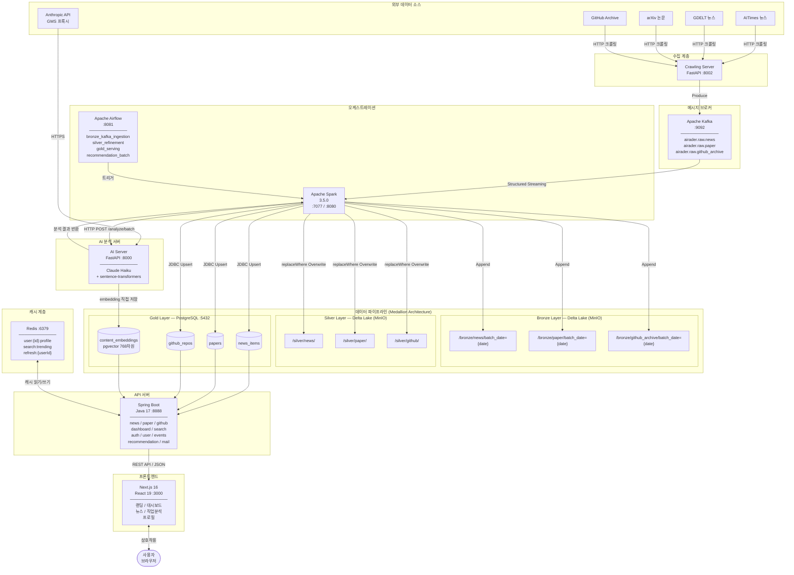

# 전체 시스템 아키텍처

```mermaid
graph TB
    subgraph EXT["외부 데이터 소스"]
        SRC1[AITimes 뉴스]
        SRC2[GDELT 뉴스]
        SRC3[arXiv 논문]
        SRC4[GitHub Archive]
        SRC5[Anthropic API\nGMS 프록시]
    end

    subgraph COLLECT["수집 계층"]
        CRAWL["Crawling Server\nFastAPI :8002"]
    end

    subgraph BROKER["메시지 브로커"]
        KAFKA["Apache Kafka\n:9092\n─────────────\nairader.raw.news\nairader.raw.paper\nairader.raw.github_archive"]
    end

    subgraph PIPELINE["데이터 파이프라인 (Medallion Architecture)"]
        subgraph BRONZE["Bronze Layer — Delta Lake (MinIO)"]
            B1["/bronze/news/batch_date={date}"]
            B2["/bronze/paper/batch_date={date}"]
            B3["/bronze/github_archive/batch_date={date}"]
        end
        subgraph SILVER["Silver Layer — Delta Lake (MinIO)"]
            S1["/silver/news/"]
            S2["/silver/paper/"]
            S3["/silver/github/"]
        end
        subgraph GOLD["Gold Layer — PostgreSQL :5432"]
            G1[(news_items)]
            G2[(papers)]
            G3[(github_repos)]
            G4[(content_embeddings\npgvector 768차원)]
        end
    end

    subgraph AI["AI 분석 서버"]
        AISVR["AI Server\nFastAPI :8000\n─────────────\nClaude Haiku\n+ sentence-transformers"]
    end

    subgraph ORCH["오케스트레이션"]
        AF["Apache Airflow\n:8081\n─────────────\nbronze_kafka_ingestion\nsilver_refinement\ngold_serving\nrecommendation_batch"]
        SP["Apache Spark\n3.5.0\n:7077 / :8080"]
    end

    subgraph CACHE["캐시 계층"]
        REDIS["Redis :6379\n─────────────\nuser:{id}:profile\nsearch:trending\nrefresh:{userId}"]
    end

    subgraph API["API 서버"]
        BOOT["Spring Boot\nJava 17 :8888\n─────────────\nnews / paper / github\ndashboard / search\nauth / user / events\nrecommendation / mail"]
    end

    subgraph FE["프론트엔드"]
        NEXT["Next.js 16\nReact 19 :3000\n─────────────\n랜딩 / 대시보드\n뉴스 / 직업분석\n프로필"]
    end

    USER([사용자\n브라우저])

    SRC1 & SRC2 & SRC3 & SRC4 -->|HTTP 크롤링| CRAWL
    SRC5 -->|HTTPS| AISVR
    CRAWL -->|Produce| KAFKA
    KAFKA -->|Structured Streaming| SP
    AF -->|트리거| SP
    SP -->|Append| B1 & B2 & B3
    SP -->|HTTP POST /analyze/batch| AISVR
    AISVR -->|분석 결과 반환| SP
    AISVR -->|embedding 직접 저장| G4
    SP -->|replaceWhere Overwrite| S1 & S2 & S3
    SP -->|JDBC Upsert| G1 & G2 & G3
    G1 & G2 & G3 & G4 --> BOOT
    REDIS <-->|캐시 읽기/쓰기| BOOT
    BOOT -->|REST API / JSON| NEXT
    NEXT <-->|상호작용| USER
```
