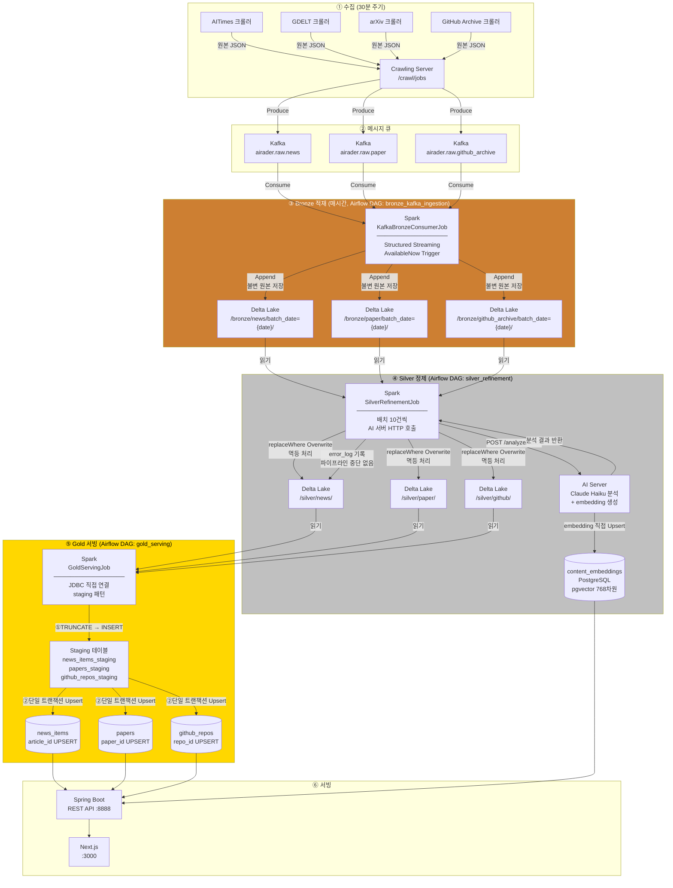

# 데이터 파이프라인 흐름

```mermaid
flowchart TD
    subgraph CRAWL["① 수집 (30분 주기)"]
        C1["Crawling Server\n/crawl/jobs"]
        C2["AITimes 크롤러"]
        C3["GDELT 크롤러"]
        C4["arXiv 크롤러"]
        C5["GitHub Archive 크롤러"]
        C2 & C3 & C4 & C5 -->|원본 JSON| C1
    end

    subgraph MQ["② 메시지 큐"]
        K1["Kafka\nairader.raw.news"]
        K2["Kafka\nairader.raw.paper"]
        K3["Kafka\nairader.raw.github_archive"]
        C1 -->|Produce| K1 & K2 & K3
    end

    subgraph BRONZE["③ Bronze 적재 (매시간, Airflow DAG: bronze_kafka_ingestion)"]
        SP1["Spark\nKafkaBronzeConsumerJob\n─────────────────\nStructured Streaming\nAvailableNow Trigger"]
        B1["Delta Lake\n/bronze/news/batch_date={date}/"]
        B2["Delta Lake\n/bronze/paper/batch_date={date}/"]
        B3["Delta Lake\n/bronze/github_archive/batch_date={date}/"]
        K1 & K2 & K3 -->|Consume| SP1
        SP1 -->|Append\n불변 원본 저장| B1 & B2 & B3
    end

    subgraph SILVER["④ Silver 정제 (Airflow DAG: silver_refinement)"]
        SP2["Spark\nSilverRefinementJob\n─────────────────\n배치 10건씩\nAI 서버 HTTP 호출"]
        AI["AI Server\nClaude Haiku 분석\n+ embedding 생성"]
        S1["Delta Lake\n/silver/news/"]
        S2["Delta Lake\n/silver/paper/"]
        S3["Delta Lake\n/silver/github/"]
        EMB[("content_embeddings\nPostgreSQL\npgvector 768차원")]

        B1 & B2 & B3 -->|읽기| SP2
        SP2 -->|POST /analyze/batch| AI
        AI -->|분석 결과 반환| SP2
        AI -->|embedding 직접 Upsert| EMB
        SP2 -->|replaceWhere Overwrite\n멱등 처리| S1 & S2 & S3
        SP2 -->|error_log 기록\n파이프라인 중단 없음| S1
    end

    subgraph GOLD["⑤ Gold 서빙 (Airflow DAG: gold_serving)"]
        SP3["Spark\nGoldServingJob\n─────────────────\nJDBC 직접 연결\nstaging 패턴"]
        STG["Staging 테이블\nnews_items_staging\npapers_staging\ngithub_repos_staging"]
        G1[("news_items\narticle_id UPSERT")]
        G2[("papers\npaper_id UPSERT")]
        G3[("github_repos\nrepo_id UPSERT")]

        S1 & S2 & S3 -->|읽기| SP3
        SP3 -->|①TRUNCATE → INSERT| STG
        STG -->|②단일 트랜잭션 Upsert| G1 & G2 & G3
    end

    subgraph SERVE["⑥ 서빙"]
        API["Spring Boot\nREST API :8888"]
        FE["Next.js\n:3000"]
        G1 & G2 & G3 & EMB --> API --> FE
    end

    style BRONZE fill:#cd7f32,color:#fff
    style SILVER fill:#c0c0c0,color:#000
    style GOLD fill:#ffd700,color:#000
```
