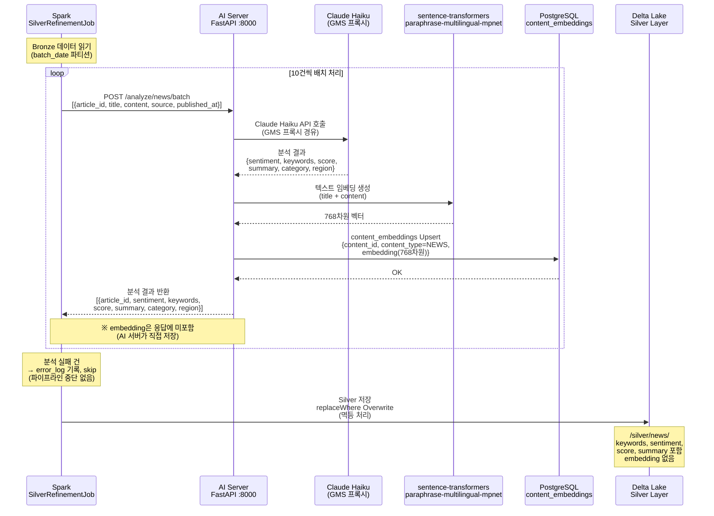

# AI 분석 흐름

```mermaid
sequenceDiagram
    participant SP as Spark<br/>SilverRefinementJob
    participant AI as AI Server<br/>FastAPI :8000
    participant LLM as Claude Haiku<br/>(GMS 프록시)
    participant EMB as sentence-transformers<br/>paraphrase-multilingual-mpnet
    participant PG as PostgreSQL<br/>content_embeddings
    participant DL as Delta Lake<br/>Silver Layer

    Note over SP: Bronze 데이터 읽기<br/>(batch_date 파티션)

    loop 10건씩 배치 처리
        SP->>AI: POST /analyze/news/batch<br/>[{article_id, title, content, source, published_at}]

        AI->>LLM: Claude Haiku API 호출<br/>(GMS 프록시 경유)
        LLM-->>AI: 분석 결과<br/>{sentiment, keywords, score,<br/>summary, category, region}

        AI->>EMB: 텍스트 임베딩 생성<br/>(title + content)
        EMB-->>AI: 768차원 벡터

        AI->>PG: content_embeddings Upsert<br/>{content_id, content_type=NEWS,<br/>embedding(768차원)}
        PG-->>AI: OK

        AI-->>SP: 분석 결과 반환<br/>[{article_id, sentiment, keywords,<br/>score, summary, category, region}]
        Note over AI,SP: ※ embedding은 응답에 미포함<br/>(AI 서버가 직접 저장)
    end

    Note over SP: 분석 실패 건<br/>→ error_log 기록, skip<br/>(파이프라인 중단 없음)

    SP->>DL: Silver 저장<br/>replaceWhere Overwrite<br/>(멱등 처리)

    Note over DL: /silver/news/<br/>keywords, sentiment,<br/>score, summary 포함<br/>embedding 없음
```
