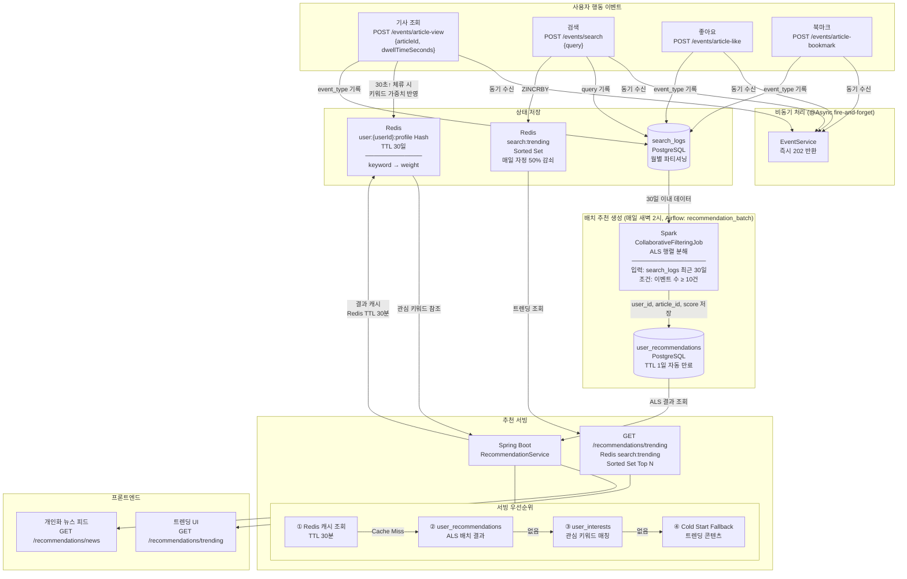

# 추천 시스템 흐름

```mermaid
flowchart TD
    subgraph USER["사용자 행동 이벤트"]
        E1["기사 조회\nPOST /events/article-view\n{articleId, dwellTimeSeconds}"]
        E2["검색\nPOST /events/search\n{query}"]
        E3["좋아요\nPOST /events/article-like"]
        E4["북마크\nPOST /events/article-bookmark"]
    end

    subgraph ASYNC["비동기 처리 (@Async fire-and-forget)"]
        EVT["EventService\n즉시 202 반환"]
    end

    subgraph STORE["상태 저장"]
        SL[("search_logs\nPostgreSQL\n월별 파티셔닝")]
        RED["Redis\nuser:{userId}:profile Hash\nTTL 30일\n─────────────\nkeyword → weight"]
        TRD["Redis\nsearch:trending\nSorted Set\n매일 자정 50% 감쇠"]
    end

    subgraph BATCH["배치 추천 생성 (매일 새벽 2시, Airflow: recommendation_batch)"]
        ALS["Spark\nCollaborativeFilteringJob\nALS 행렬 분해\n─────────────────\n입력: search_logs 최근 30일\n조건: 이벤트 수 ≥ 10건"]
        REC[("user_recommendations\nPostgreSQL\nTTL 1일 자동 만료")]
        ALS -->|user_id, article_id, score 저장| REC
    end

    subgraph SERVE["추천 서빙"]
        API["Spring Boot\nRecommendationService"]

        subgraph LOGIC["서빙 우선순위"]
            L1["① Redis 캐시 조회\nTTL 30분"]
            L2["② user_recommendations\nALS 배치 결과"]
            L3["③ user_interests\n관심 키워드 매칭"]
            L4["④ Cold Start Fallback\n트렌딩 콘텐츠"]
            L1 -->|Cache Miss| L2 -->|없음| L3 -->|없음| L4
        end

        TREND["GET /recommendations/trending\nRedis search:trending\nSorted Set Top N"]
    end

    subgraph FE["프론트엔드"]
        FEED["개인화 뉴스 피드\nGET /recommendations/news"]
        TRENDUI["트렌딩 UI\nGET /recommendations/trending"]
    end

    E1 & E2 & E3 & E4 -->|동기 수신| EVT
    E1 -->|30초↑ 체류 시\n키워드 가중치 반영| RED
    E1 & E3 & E4 -->|event_type 기록| SL
    E2 -->|query 기록| SL
    E2 -->|ZINCRBY| TRD

    SL -->|30일 이내 데이터| ALS
    RED -->|관심 키워드 참조| API
    REC -->|ALS 결과 조회| API
    TRD -->|트렌딩 조회| TREND

    API --- LOGIC
    API -->|결과 캐시\nRedis TTL 30분| RED
    API --> FEED
    TREND --> TRENDUI
```
